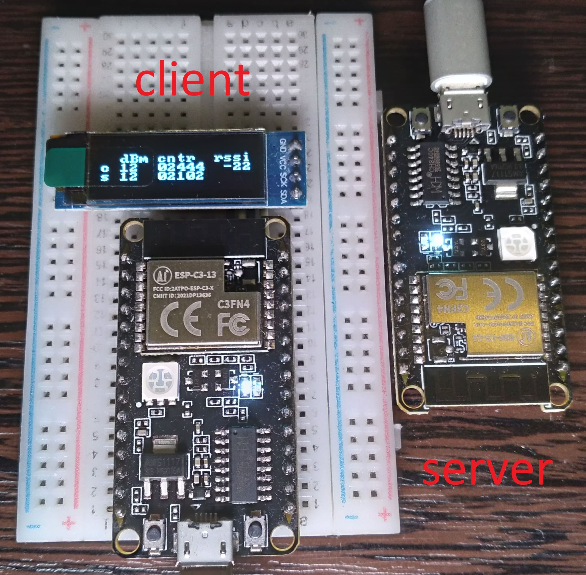

ESP32C3 NimBLE client example
====================

This example based on [SIMS-IOT-Devices / FreeRTOS-ESP-IDF-BLE-Client](https://github.com/SIMS-IOT-Devices/FreeRTOS-ESP-IDF-BLE-Client) and esp-idf example (bluetooth/nimble/blecent)The display uses the [nopnop2002/esp-idf-ssd1306](https://github.com/nopnop2002/esp-idf-ssd1306) library. Added features:

* Displaying the connection status to the server

* Display of received signal strength (rssi)
- Simple protocol through structure with counter and transmit power change (according to client power change)

This example works with the [ESP32C3 NimBLE server example](https://github.com/P0nyL0v3r/ESP32C3-NimBLE-server-example)

## Tests

Tx power +21 dBm. Measurement in the city in the line of sight.

| distance, m | RSSI, dBm | description                            |
| ----------- | --------- | -------------------------------------- |
| 11          | -56       | line of sight                          |
| 31          | -68       | line of sight                          |
| 47          | -75       | building edge interferes line of sight |
| 96          | -80       | building edge interferes line of sight |
| 144         | -83       | snowdrift interferes line of sight     |
| 179         | -87       | line of sight                          |
